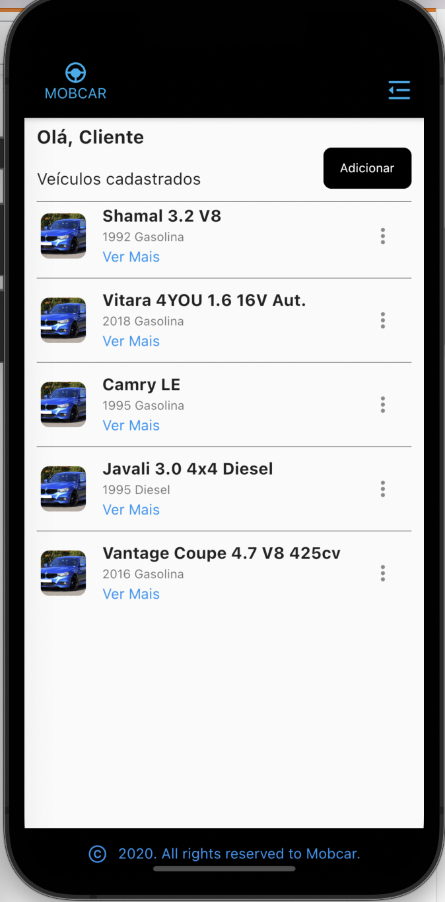
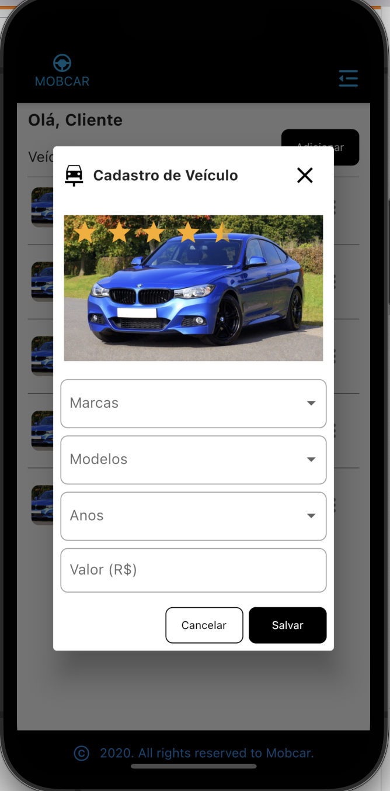
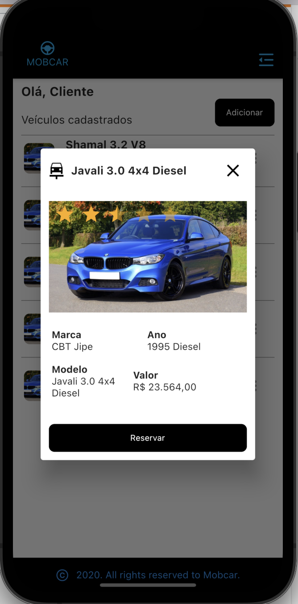
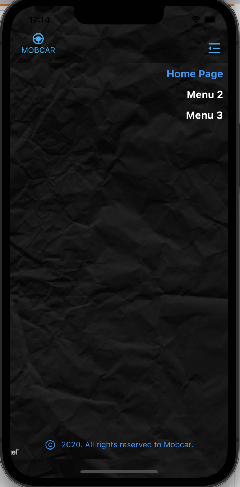

<h1 align="center">
MobCar
</h1>

<p float="left"  align="center">
  
   
  
   
</p>

## 🔖 Sobre

- O projeto **MobCar** é uma aplicação mobile onde é possível cadastrar carros detalhando a fabricante, modelo, ano e valor pela tabela FIPE. É possível listar, editar e apagar os dados dos carros favoritos que são armazenados no dispositivo. Ele usa um banco de dados público para acessar os carros e valores da tabela FIPE.
## 🚀 Tecnologias

- Dart(Flutter)
## Instalação

```bash
$ git clone https://github.com/Robertrodrigues000/desafio-mobcar.git

$ cd desafio-mobcar

$ flutter run lib/main.dart

```